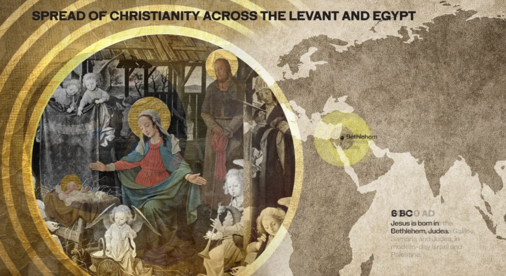
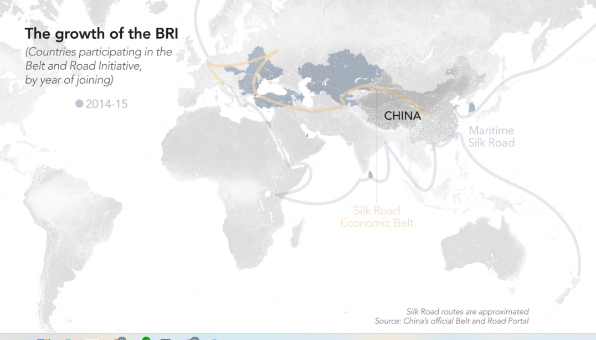

# ⁉️ ¿Qué es scrollytelling?

El scrollytelling es una innovadora técnica para la narrativa digital, permite contar historias combinando texto, imágenes, videos y animaciones que se activan al "scrollear" o desplazarse por la página.&#x20;

La simpleza de la interacción basada en scrollear permite que el lector experimente la historia sin distracciones y de manera dinámica.&#x20;

Algunos ejemplos a continuación.

## The Coptic miracle

**How Egypt's historic Christian church survived and thrived**

An Arab News Minority Report

_**Link:**_ [_**https://www.arabnews.com/Copts**_](https://www.arabnews.com/Copts)

<figure><figcaption></figcaption></figure>

Road to nowhere:\
China’s Belt and Road Initiative at tipping point
-------------------------------------------------

Pakistan, Sri Lanka debt crises threaten Beijing's regional influence

By Adnan Aamir, Marwaan Macan-Markar, Shaun Turton, Cissy Zhou and Grace Li

_**Link:**_ [https://nikkei.shorthandstories.com/road-to-nowhere-china-s-belt-and-road-initiative/](https://nikkei.shorthandstories.com/road-to-nowhere-china-s-belt-and-road-initiative/)

<figure><figcaption></figcaption></figure>

Si bien estas visualizaciones resultan muy atracivas, su producción requiere tradicionalmente tiempo y recursos, lo que inicialmente limitó su uso a grandes publicaciones y proyectos de alto presupuesto.&#x20;

Hoy con herramientas más accesibles como _**Quarto**_, es posible crear scrollytelling.
